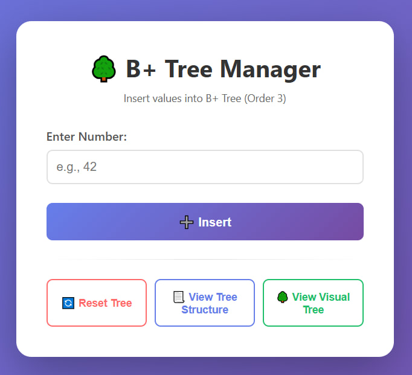
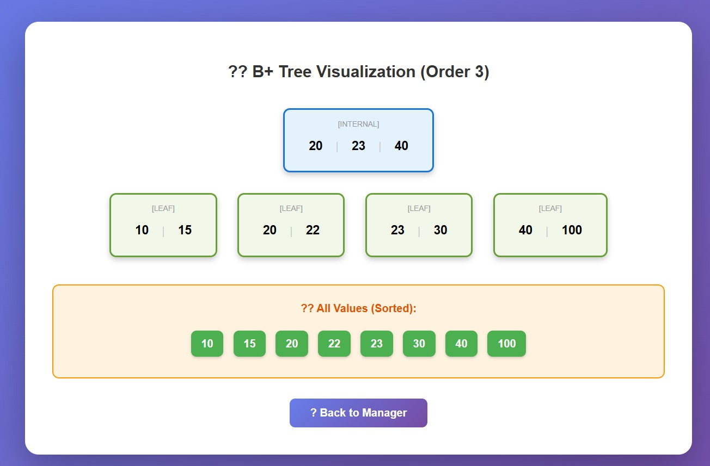

# 🌳 B+ Tree Visualization

An interactive web-based B+ Tree data structure visualization tool with a C-based CGI backend and HTML/CSS frontend.

## 📋 Features

- ✅ **Insert** values into the B+ Tree
- 🌳 **Visual Tree Display** with color-coded nodes
- 📃 **View Tree Structure** To display the tree in text
- 🔄 **Reset Tree**  to start fresh
  

## 🛠️ Technologies Used

- **Backend:** C (CGI)
- **Frontend:** HTML5, CSS3
- **Server:** Apache (XAMPP)
- **Order:** 3 (configurable)

## 📂 Project Structure
```
bplustree/
├── BPlusTree/
│   ├── main.c             
│   ├── BPlusTree.vcxproj   
│   └── BPlusTree.vcxproj.filters             
├── index.html             
├── .gitignore              
└── README.md             
```

## 🚀 Steps to Run

1. **Clone the repository**
```bash
   git clone https://github.com/YOUR_USERNAME/BPlusTree-Visualization.git
   cd BPlusTree-Visualization
```

2. **Build the C program**
   - Open the project folder in **Visual Studio**
   - Press `Ctrl + Shift + B` to build the solution
   - The executable will be generated in: `BPlusTree\Debug\BPlusTree.exe`

3. **Copy files to XAMPP**
```bash
   # Copy the executable to CGI directory
   copy BPlusTree\Debug\BPlusTree.exe C:\xampp\cgi-bin\

   # Copy the web interface
   copy index.html C:\xampp\htdocs\BPlusTree\
```

4. **Start Apache Server**
   - Open **XAMPP Control Panel**
   - Click **Start** next to **Apache**

5. **Access the application**
```
   Open browser and navigate to:
   http://localhost/BPlusTree/index.html
```

## 📖 Usage

### Insert a Value
1. Enter a number in the input field
2. Click **"➕ Insert"**
3. The value will be added to the B+ Tree
4. View the visual representation by clicking **"🌳 View Visual Tree"**

### Reset Tree
Click "🔄 Reset Tree" to clear all data and reset the tree to empty.

### View Tree Structure
Click "📃 View Tree Structure" to display the tree in text format as saved in the file.

### View Visual Tree
Click "🌳 View Visual Tree" to open a page showing the tree visually with colors.

---
## 📸 Screenshots

###  Home



###  Visualization



